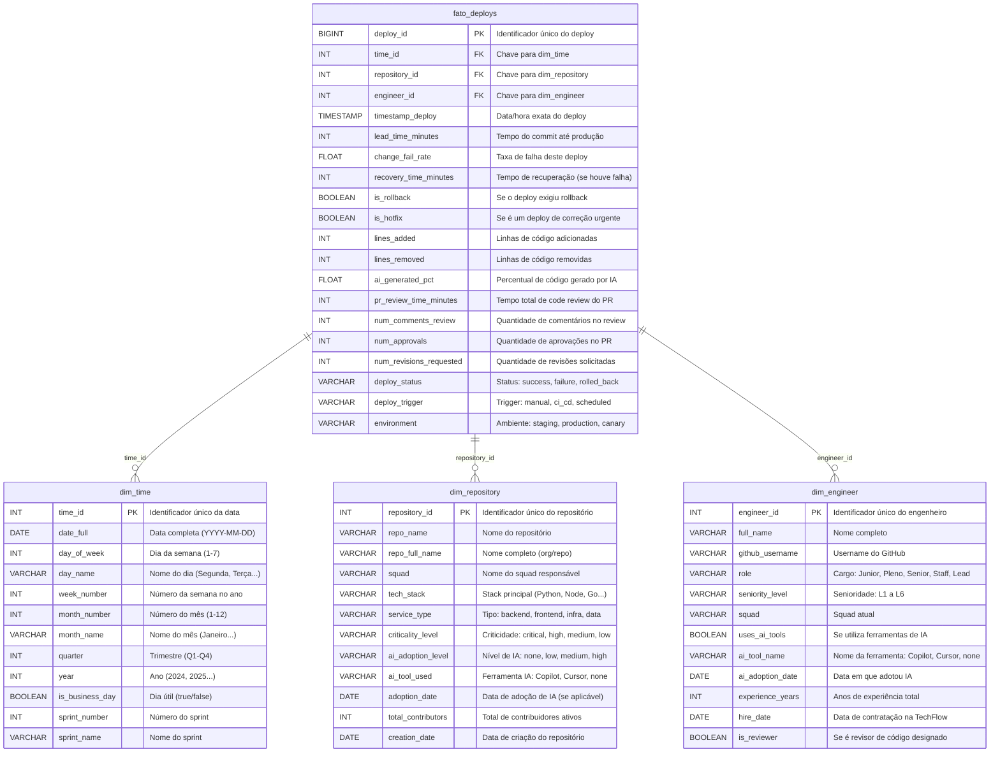
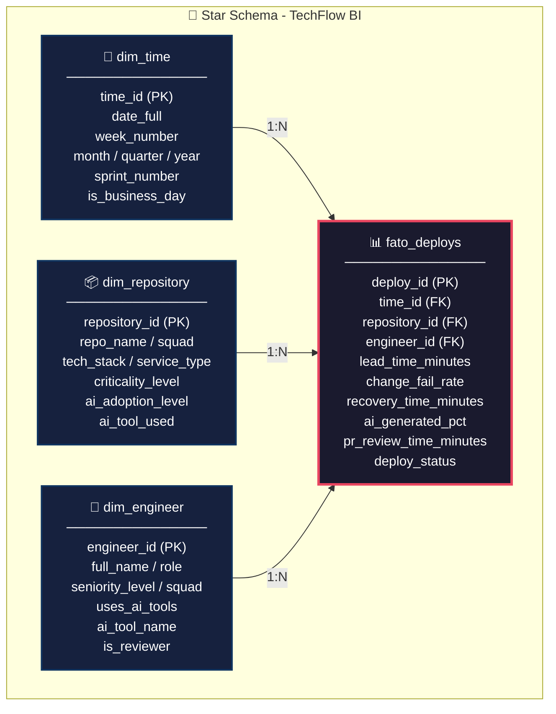

# 1. Modelagem Dimensional — Star Schema

## 1.1 Visão Geral do Modelo

A modelagem segue o padrão **Star Schema** (Esquema Estrela) de Ralph Kimball, otimizado para consultas analíticas. O modelo é composto por:

- **1 Tabela de Fatos**: `fato_deploys` — registra cada evento de deploy e suas métricas associadas
- **3 Tabelas de Dimensão**: `dim_time`, `dim_repository`, `dim_engineer` — fornecem contexto para análise multidimensional

> **Por que Star Schema?**  
> É o modelo mais eficiente para Data Warehouses analíticos. Ele reduz JOINs complexos, acelera consultas agregadas e é nativamente suportado por ferramentas de BI como Power BI, Looker e Tableau.

---

## 1.2 Diagrama do Star Schema



---

## 1.3 Tabela de Fatos — `fato_deploys`

Esta tabela registra **cada evento de deploy** realizado na TechFlow. Cada linha é um **deploy único** com todas as métricas necessárias para o cálculo dos indicadores DORA.

| # | Campo | Tipo de Dado | Descrição | Métrica DORA |
|---|-------|-------------|-----------|-------------|
| 1 | `deploy_id` | `BIGINT (PK)` | Identificador único do deploy. Chave primária surrogate gerada sequencialmente | — |
| 2 | `time_id` | `INT (FK)` | Chave estrangeira para `dim_time`. Permite análises temporais e agrupamento por sprint, mês, trimestre | — |
| 3 | `repository_id` | `INT (FK)` | Chave estrangeira para `dim_repository`. Conecta o deploy ao repositório e squad | — |
| 4 | `engineer_id` | `INT (FK)` | Chave estrangeira para `dim_engineer`. Identifica o engenheiro responsável pelo deploy | — |
| 5 | `timestamp_deploy` | `TIMESTAMP` | Data e hora exatas em que o deploy foi executado. Resolução em segundos para análise de picos | Deployment Frequency |
| 6 | `lead_time_minutes` | `INT` | Tempo total (em minutos) entre o **primeiro commit** da feature e a chegada em **produção**. Inclui tempo de desenvolvimento, code review e pipeline CI/CD | **Lead Time for Changes** |
| 7 | `change_fail_rate` | `FLOAT` | Proporção (0.0 a 1.0) de vezes que este deploy resultou em falha, degradação de serviço ou necessidade de rollback | **Change Failure Rate** |
| 8 | `recovery_time_minutes` | `INT` | Tempo (em minutos) para restaurar o serviço ao estado estável após uma falha causada por este deploy. `NULL` se não houve falha | **Mean Time to Recovery** |
| 9 | `is_rollback` | `BOOLEAN` | Indica se este deploy exigiu rollback (`true`) ou foi bem-sucedido (`false`). Essencial para calcular Change Failure Rate | Change Failure Rate |
| 10 | `is_hotfix` | `BOOLEAN` | Indica se este deploy é uma correção urgente de um problema em produção | MTTR / CFR |
| 11 | `lines_added` | `INT` | Total de linhas de código adicionadas neste deploy. Fonte: GitHub API (diff) | Análise de Volume |
| 12 | `lines_removed` | `INT` | Total de linhas de código removidas neste deploy | Análise de Volume |
| 13 | `ai_generated_pct` | `FLOAT` | Percentual estimado (0.0 a 1.0) de código gerado por IA Generativa neste deploy. Derivado de metadata do Copilot/Cursor | **Métrica IA** |
| 14 | `pr_review_time_minutes` | `INT` | Tempo total (em minutos) entre a abertura do Pull Request e a aprovação final | Análise de Gargalo |
| 15 | `num_comments_review` | `INT` | Número de comentários realizados durante o Code Review do PR | Qualidade do Review |
| 16 | `num_approvals` | `INT` | Quantidade de aprovações recebidas no PR antes do merge | Qualidade do Review |
| 17 | `num_revisions_requested` | `INT` | Número de vezes que o revisor solicitou alterações (changes requested) | Qualidade do Código IA |
| 18 | `deploy_status` | `VARCHAR(20)` | Status final do deploy: `success`, `failure`, `rolled_back`, `partial` | Change Failure Rate |
| 19 | `deploy_trigger` | `VARCHAR(20)` | O que disparou o deploy: `manual`, `ci_cd`, `scheduled`, `hotfix` | Análise de Automação |
| 20 | `environment` | `VARCHAR(20)` | Ambiente de destino: `staging`, `production`, `canary` | Segmentação |

> **Granularidade**: Cada linha = 1 evento de deploy. A granularidade fina permite drill-down até o nível de PR individual.

---

## 1.4 Dimensão — `dim_time` (Dimensão Temporal)

A dimensão temporal é a **mais crítica** para análise de tendências DORA. Permite agrupar métricas por dia, semana, sprint, mês ou trimestre.

| # | Campo | Tipo de Dado | Descrição | Uso Analítico |
|---|-------|-------------|-----------|--------------|
| 1 | `time_id` | `INT (PK)` | Chave primária surrogate. Formato recomendado: `YYYYMMDD` (ex: 20250115) | Chave de junção |
| 2 | `date_full` | `DATE` | Data completa no formato `YYYY-MM-DD` | Eixo X de gráficos temporais |
| 3 | `day_of_week` | `INT` | Dia da semana (1=Segunda, 7=Domingo). Padrão ISO 8601 | Análise de padrões semanais |
| 4 | `day_name` | `VARCHAR(15)` | Nome do dia por extenso (Segunda-feira, Terça-feira...) | Labels em dashboards |
| 5 | `week_number` | `INT` | Número da semana no ano (1-52/53). Padrão ISO 8601 | Agrupamento semanal |
| 6 | `month_number` | `INT` | Número do mês (1-12) | Agrupamento mensal |
| 7 | `month_name` | `VARCHAR(15)` | Nome do mês por extenso (Janeiro, Fevereiro...) | Labels em dashboards |
| 8 | `quarter` | `INT` | Trimestre (1=Q1, 2=Q2, 3=Q3, 4=Q4) | Relatórios trimestrais para CTO |
| 9 | `year` | `INT` | Ano (2024, 2025...) | Comparativo Year-over-Year |
| 10 | `is_business_day` | `BOOLEAN` | Se é dia útil (`true`) ou fim de semana/feriado (`false`) | Filtrar deploys em dias úteis |
| 11 | `sprint_number` | `INT` | Número sequencial do sprint no ano | Alinhamento com ciclos ágeis |
| 12 | `sprint_name` | `VARCHAR(50)` | Nome descritivo do sprint (ex: "Sprint 23 - Auth Refactor") | Labels em dashboards |

> **Dica de implementação**: Pré-popular esta tabela com 2-3 anos de datas (passado + futuro). Cada dia é uma linha.

---

## 1.5 Dimensão — `dim_repository` (Dimensão de Repositório)

Permite segmentar as métricas DORA por **repositório, squad, stack tecnológica e nível de adoção de IA**. É a dimensão mais importante para o cenário da TechFlow.

| # | Campo | Tipo de Dado | Descrição | Uso Analítico |
|---|-------|-------------|-----------|--------------|
| 1 | `repository_id` | `INT (PK)` | Chave primária surrogate do repositório | Chave de junção |
| 2 | `repo_name` | `VARCHAR(100)` | Nome curto do repositório (ex: `payment-service`) | Identificação rápida |
| 3 | `repo_full_name` | `VARCHAR(200)` | Nome completo no GitHub (ex: `techflow/payment-service`) | Referência API GitHub |
| 4 | `squad` | `VARCHAR(50)` | Nome do squad responsável (ex: Payments, Platform, Growth) | **Filtro principal Nível 2** |
| 5 | `tech_stack` | `VARCHAR(50)` | Stack tecnológica principal: Python, Node.js, Go, Java | Segmentação por linguagem |
| 6 | `service_type` | `VARCHAR(20)` | Tipo de serviço: `backend`, `frontend`, `infra`, `data`, `mobile` | Segmentação por área |
| 7 | `criticality_level` | `VARCHAR(10)` | Nível de criticidade: `critical`, `high`, `medium`, `low` | Priorização de análise |
| 8 | `ai_adoption_level` | `VARCHAR(10)` | Nível de adoção de IA: `none`, `low`, `medium`, `high` | **Comparativo IA key** |
| 9 | `ai_tool_used` | `VARCHAR(30)` | Ferramenta de IA usada: `Copilot`, `Cursor`, `Cody`, `none` | Análise por ferramenta |
| 10 | `adoption_date` | `DATE` | Data de adoção de IA no repositório. `NULL` se não adotou | Marco temporal antes/depois |
| 11 | `total_contributors` | `INT` | Número total de contribuidores ativos nos últimos 90 dias | Dimensionamento de equipe |
| 12 | `creation_date` | `DATE` | Data de criação do repositório | Maturidade do serviço |

> **Campo-chave para o estudo**: `ai_adoption_level` permite criar o comparativo **com IA vs. sem IA** que o CTO precisa ver.

---

## 1.6 Dimensão — `dim_engineer` (Dimensão de Engenheiro)

Permite análise no nível individual: quem está usando IA, qual a senioridade, e como isso se correlaciona com as métricas DORA.

| # | Campo | Tipo de Dado | Descrição | Uso Analítico |
|---|-------|-------------|-----------|--------------|
| 1 | `engineer_id` | `INT (PK)` | Chave primária surrogate do engenheiro | Chave de junção |
| 2 | `full_name` | `VARCHAR(100)` | Nome completo do engenheiro | Identificação |
| 3 | `github_username` | `VARCHAR(50)` | Username no GitHub (ex: `@jsilva`) | Referência API GitHub |
| 4 | `role` | `VARCHAR(30)` | Cargo: `Junior Engineer`, `Pleno Engineer`, `Senior Engineer`, `Staff Engineer`, `Tech Lead` | Segmentação por cargo |
| 5 | `seniority_level` | `VARCHAR(5)` | Nível de senioridade: `L1` (Junior) a `L6` (Principal) | Correlação senioridade × qualidade IA |
| 6 | `squad` | `VARCHAR(50)` | Squad atual do engenheiro | Agrupamento por time |
| 7 | `uses_ai_tools` | `BOOLEAN` | Se utiliza ferramentas de IA para codificação | **Segmentação IA vs Não-IA** |
| 8 | `ai_tool_name` | `VARCHAR(30)` | Ferramenta utilizada: `Copilot`, `Cursor`, `ChatGPT`, `none` | Análise por ferramenta |
| 9 | `ai_adoption_date` | `DATE` | Data em que começou a usar IA. `NULL` se não usa | Análise temporal de adoção |
| 10 | `experience_years` | `INT` | Anos de experiência profissional total | Correlação experiência × qualidade |
| 11 | `hire_date` | `DATE` | Data de contratação na TechFlow | Tempo de casa |
| 12 | `is_reviewer` | `BOOLEAN` | Se é designado como revisor de código | Análise de gargalo em reviews |

> **Insight esperado**: Engenheiros seniores com IA produzem código mais estável que juniores com IA? A dimensão permite responder.

---

## 1.7 Métricas DORA — Fórmulas de Cálculo SQL

As quatro métricas DORA são derivadas diretamente da tabela `fato_deploys` combinada com as dimensões. Abaixo, cada métrica com sua definição, fórmula SQL e interpretação.

### 1.7.1 📈 Deployment Frequency (Frequência de Deploy)

**Definição**: Com que frequência a organização realiza deploys em produção com sucesso.

**Fórmula SQL**:
```sql
-- Deployment Frequency por semana e por squad
SELECT 
    dt.year,
    dt.week_number,
    dr.squad,
    COUNT(f.deploy_id) AS total_deploys,
    COUNT(f.deploy_id) / 5.0 AS deploys_per_day  -- 5 dias úteis
FROM fato_deploys f
JOIN dim_time dt ON f.time_id = dt.time_id
JOIN dim_repository dr ON f.repository_id = dr.repository_id
WHERE f.deploy_status = 'success'
  AND f.environment = 'production'
  AND dt.is_business_day = TRUE
GROUP BY dt.year, dt.week_number, dr.squad
ORDER BY dt.year DESC, dt.week_number DESC;
```

**Benchmarks DORA (2025)**:
| Classificação | Frequência |
|--------------|-----------|
| 🟢 Elite | Múltiplos deploys por dia |
| 🔵 High | Entre 1 deploy/dia e 1/semana |
| 🟡 Medium | Entre 1/semana e 1/mês |
| 🔴 Low | Menos de 1/mês |

---

### 1.7.2 ⏱️ Lead Time for Changes (Tempo de Entrega)

**Definição**: Tempo decorrido entre o primeiro commit de uma mudança e o momento em que ela está rodando em produção.

**Fórmula SQL**:
```sql
-- Lead Time médio por squad, comparando repositórios com e sem IA
SELECT 
    dr.squad,
    dr.ai_adoption_level,
    ROUND(AVG(f.lead_time_minutes), 2) AS avg_lead_time_min,
    ROUND(AVG(f.lead_time_minutes) / 60.0, 2) AS avg_lead_time_hours,
    PERCENTILE_CONT(0.5) WITHIN GROUP (ORDER BY f.lead_time_minutes) AS median_lead_time,
    PERCENTILE_CONT(0.95) WITHIN GROUP (ORDER BY f.lead_time_minutes) AS p95_lead_time
FROM fato_deploys f
JOIN dim_repository dr ON f.repository_id = dr.repository_id
WHERE f.environment = 'production'
GROUP BY dr.squad, dr.ai_adoption_level
ORDER BY dr.squad, dr.ai_adoption_level;
```

**Benchmarks DORA (2025)**:
| Classificação | Lead Time |
|--------------|----------|
| 🟢 Elite | Menos de 1 hora |
| 🔵 High | Entre 1 hora e 1 dia |
| 🟡 Medium | Entre 1 dia e 1 semana |
| 🔴 Low | Mais de 1 mês |

---

### 1.7.3 🚨 Change Failure Rate (Taxa de Falha em Mudanças)

**Definição**: Percentual de deploys em produção que resultam em falha, degradação de serviço ou necessidade de rollback.

**Fórmula SQL**:
```sql
-- Change Failure Rate mensal, segmentado por % de código IA
SELECT 
    dt.year,
    dt.month_name,
    -- Segmentação por faixa de IA
    CASE 
        WHEN f.ai_generated_pct >= 0.7 THEN 'Alta IA (>70%)'
        WHEN f.ai_generated_pct >= 0.3 THEN 'Média IA (30-70%)'
        ELSE 'Baixa/Sem IA (<30%)'
    END AS ai_segment,
    COUNT(*) AS total_deploys,
    SUM(CASE WHEN f.is_rollback = TRUE OR f.deploy_status = 'failure' THEN 1 ELSE 0 END) AS failed_deploys,
    ROUND(
        SUM(CASE WHEN f.is_rollback = TRUE OR f.deploy_status = 'failure' THEN 1 ELSE 0 END) * 100.0 / COUNT(*),
        2
    ) AS change_failure_rate_pct
FROM fato_deploys f
JOIN dim_time dt ON f.time_id = dt.time_id
WHERE f.environment = 'production'
GROUP BY dt.year, dt.month_name, dt.month_number, ai_segment
ORDER BY dt.year, dt.month_number;
```

**Benchmarks DORA (2025)**:
| Classificação | Taxa de Falha |
|--------------|--------------|
| 🟢 Elite | < 5% |
| 🔵 High | 5% - 10% |
| 🟡 Medium | 10% - 15% |
| 🔴 Low | > 15% |

---

### 1.7.4 🔄 Mean Time to Recovery — MTTR (Tempo Médio de Recuperação)

**Definição**: Tempo médio para restaurar o serviço após uma falha ou incidente em produção.

**Fórmula SQL**:
```sql
-- MTTR por repositório e criticidade
SELECT 
    dr.repo_name,
    dr.criticality_level,
    dr.ai_adoption_level,
    COUNT(*) AS total_incidents,
    ROUND(AVG(f.recovery_time_minutes), 2) AS avg_mttr_minutes,
    ROUND(AVG(f.recovery_time_minutes) / 60.0, 2) AS avg_mttr_hours,
    ROUND(MAX(f.recovery_time_minutes) / 60.0, 2) AS max_mttr_hours,
    ROUND(MIN(f.recovery_time_minutes) / 60.0, 2) AS min_mttr_hours
FROM fato_deploys f
JOIN dim_repository dr ON f.repository_id = dr.repository_id
WHERE f.is_rollback = TRUE 
   OR f.deploy_status IN ('failure', 'rolled_back')
GROUP BY dr.repo_name, dr.criticality_level, dr.ai_adoption_level
ORDER BY avg_mttr_minutes DESC;
```

**Benchmarks DORA (2025)**:
| Classificação | MTTR |
|--------------|------|
| 🟢 Elite | Menos de 1 hora |
| 🔵 High | Menos de 1 dia |
| 🟡 Medium | Entre 1 dia e 1 semana |
| 🔴 Low | Mais de 1 mês |

---

### 1.7.5 🤖 Métricas Adicionais — Impacto da IA Generativa

Além das 4 métricas DORA clássicas, o modelo suporta métricas específicas para avaliar o impacto da IA:

```sql
-- Análise correlacional: % de IA vs. qualidade
SELECT 
    CASE 
        WHEN f.ai_generated_pct >= 0.7 THEN 'Alta IA (>70%)'
        WHEN f.ai_generated_pct >= 0.3 THEN 'Média IA (30-70%)'
        ELSE 'Baixa/Sem IA (<30%)'
    END AS ai_band,
    COUNT(*) AS total_deploys,
    ROUND(AVG(f.lead_time_minutes) / 60.0, 1) AS avg_lead_time_hours,
    ROUND(AVG(f.pr_review_time_minutes) / 60.0, 1) AS avg_review_time_hours,
    ROUND(AVG(f.num_comments_review), 1) AS avg_comments,
    ROUND(AVG(f.num_revisions_requested), 1) AS avg_revisions,
    ROUND(
        SUM(CASE WHEN f.is_rollback THEN 1 ELSE 0 END) * 100.0 / COUNT(*), 1
    ) AS failure_rate_pct,
    ROUND(AVG(CASE WHEN f.is_rollback THEN f.recovery_time_minutes END) / 60.0, 1) AS avg_mttr_hours
FROM fato_deploys f
GROUP BY ai_band
ORDER BY ai_band;
```

**Tabela de interpretação esperada**:

| Faixa de IA | Deploys | Lead Time (h) | Review Time (h) | Comentários | Revisões | Failure Rate | MTTR (h) |
|------------|---------|---------------|-----------------|------------|----------|-------------|---------|
| Baixa/Sem IA | 180 | 12.5 | 4.2 | 3.1 | 0.8 | 4.2% | 1.5 |
| Média IA | 320 | 6.8 | 6.1 | 5.4 | 1.9 | 8.7% | 2.3 |
| Alta IA | 150 | 3.2 | 8.5 | 7.8 | 3.2 | 14.1% | 4.7 |

> **Leitura do dado hipotético**: A IA reduz o lead time de 12.5h para 3.2h, mas o Code Review passa de 4.2h para 8.5h e a taxa de falha salta de 4.2% para 14.1%. Isso é o "caos mais rápido" que o CTO suspeita.

---

## 1.8 Resumo das Relações do Modelo



---

> **Próximo passo**: Com o modelo dimensional definido, a [Arquitetura de Dados](../02_arquitetura_dados/arquitetura_dados.md) descreve como os dados fluem das fontes (GitHub, Jira) até essas tabelas no Data Warehouse.
