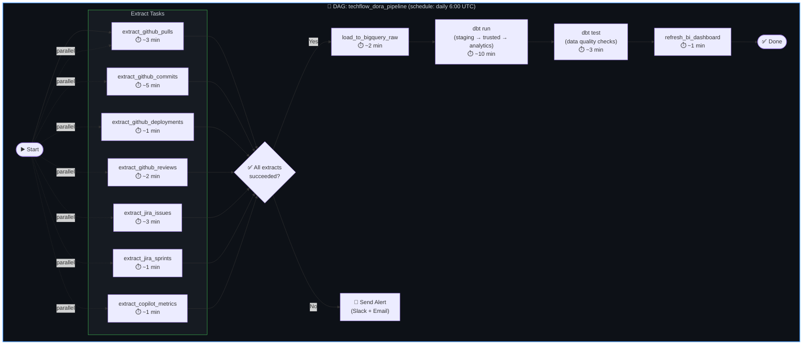

# 2. Arquitetura de Dados — Pipeline ELT

## 2.1 Visão Geral da Arquitetura

A arquitetura adotada segue o padrão **ELT (Extract → Load → Transform)**, nativo da nuvem, onde os dados são extraídos das fontes operacionais (GitHub e Jira), carregados em estado bruto no Data Warehouse e transformados via SQL diretamente dentro do warehouse.

---

## 2.2 Diagrama do Pipeline ELT Completo

```mermaid
flowchart LR
    subgraph SOURCES["🔌 FONTES DE DADOS (Extract)"]
        direction TB
        GH["<b>GitHub REST API</b><br/>─────────────<br/>📋 Pull Requests<br/>📝 Commits<br/>🚀 Deployments<br/>📊 Code Frequency<br/>💬 PR Reviews"]
        JR["<b>Jira REST API</b><br/>─────────────<br/>🎯 Sprints<br/>📌 Stories / Tasks<br/>🐛 Bugs & Incidents<br/>👥 Assignees<br/>📅 Sprint Dates"]
        CP["<b>Copilot / Cursor API</b><br/>─────────────<br/>🤖 AI Usage Metrics<br/>📈 Acceptance Rate<br/>💻 Lines Suggested"]
    end

    subgraph INGESTION["⚙️ INGESTÃO"]
        direction TB
        AF["<b>Apache Airflow</b><br/>Cloud Composer<br/>─────────────<br/>🔄 Orquestração<br/>📅 Schedule diário<br/>🔁 Retry automático<br/>📧 Alertas em falha"]
    end

    subgraph DW["☁️ DATA WAREHOUSE (Load)"]
        direction TB
        subgraph RAW["🗃️ Camada RAW"]
            R1["raw_github_pulls"]
            R2["raw_github_commits"]
            R3["raw_github_deployments"]
            R4["raw_github_reviews"]
            R5["raw_jira_issues"]
            R6["raw_jira_sprints"]
            R7["raw_copilot_metrics"]
        end
    end

    subgraph TRANSFORM["🔧 TRANSFORMAÇÃO (Transform)"]
        direction TB
        DBT["<b>dbt (data build tool)</b><br/>─────────────<br/>📐 Modelos SQL<br/>🧪 Testes de dados<br/>📚 Documentação<br/>🔀 Versionamento Git"]
        
        subgraph STAGING["📦 Camada STAGING"]
            S1["stg_pulls"]
            S2["stg_commits"]
            S3["stg_deployments"]
            S4["stg_reviews"]
            S5["stg_issues"]
            S6["stg_sprints"]
        end
        
        subgraph TRUSTED["✅ Camada TRUSTED"]
            T1["int_deploy_metrics"]
            T2["int_review_metrics"]
            T3["int_ai_impact"]
        end
        
        subgraph ANALYTICS["📊 Camada ANALYTICS"]
            A1["fato_deploys"]
            A2["dim_time"]
            A3["dim_repository"]
            A4["dim_engineer"]
        end
    end

    subgraph VIZ["📈 VISUALIZAÇÃO"]
        direction TB
        PBI["<b>Power BI / Looker</b><br/>─────────────<br/>📊 Dashboard CTO<br/>🔍 Drill-down PRs<br/>🚦 Semáforo DORA<br/>📉 Tendências"]
    end

    GH --> AF
    JR --> AF
    CP --> AF
    AF --> RAW
    RAW --> DBT
    DBT --> STAGING
    STAGING --> TRUSTED
    TRUSTED --> ANALYTICS
    ANALYTICS --> VIZ

    style SOURCES fill:#0d1117,stroke:#58a6ff,stroke-width:2px,color:#c9d1d9
    style INGESTION fill:#161b22,stroke:#f0883e,stroke-width:2px,color:#c9d1d9
    style DW fill:#161b22,stroke:#3fb950,stroke-width:2px,color:#c9d1d9
    style TRANSFORM fill:#161b22,stroke:#bc8cff,stroke-width:2px,color:#c9d1d9
    style VIZ fill:#161b22,stroke:#f778ba,stroke-width:2px,color:#c9d1d9
```

---

## 2.3 Diagrama de Camadas de Dados (Data Layers)

```mermaid
flowchart TD
    subgraph L1["🗃️ RAW LAYER — Dados Brutos"]
        direction LR
        R_DESC["<b>O que contém:</b><br/>Dados exatamente como vieram das APIs.<br/>JSON/CSV sem transformação.<br/>Append-only, imutável.<br/><br/><b>Objetivo:</b><br/>Preservar a fonte da verdade original.<br/>Permitir reprocessamento completo."]
    end

    subgraph L2["📦 STAGING LAYER — Dados Limpos"]
        direction LR
        S_DESC["<b>O que contém:</b><br/>Dados com tipos corretos, deduplicados,<br/>colunas renomeadas para padrão interno.<br/><br/><b>Transformações:</b><br/>• CAST de tipos (string → timestamp)<br/>• Remoção de duplicatas<br/>• Renomeação de colunas<br/>• Filtro de dados inválidos"]
    end

    subgraph L3["✅ TRUSTED LAYER — Dados Enriquecidos"]
        direction LR
        T_DESC["<b>O que contém:</b><br/>Dados com regras de negócio aplicadas.<br/>JOINs entre fontes, cálculos derivados.<br/><br/><b>Transformações:</b><br/>• Cálculo de lead_time_minutes<br/>• Cálculo de ai_generated_pct<br/>• JOIN GitHub + Jira por chave (branch/PR)<br/>• Classificação de criticidade"]
    end

    subgraph L4["📊 ANALYTICS LAYER — Modelo Dimensional"]
        direction LR
        A_DESC["<b>O que contém:</b><br/>Star Schema pronto para consumo.<br/>fato_deploys + dimensões.<br/><br/><b>Características:</b><br/>• Otimizado para consultas analíticas<br/>• Granularidade definida (1 linha = 1 deploy)<br/>• Métricas DORA pré-calculadas<br/>• Pronto para conexão com BI tools"]
    end

    L1 -->|"dbt: staging models"| L2
    L2 -->|"dbt: intermediate models"| L3
    L3 -->|"dbt: marts models"| L4

    style L1 fill:#1a1a2e,stroke:#e94560,stroke-width:2px,color:#ffffff
    style L2 fill:#16213e,stroke:#0f3460,stroke-width:2px,color:#ffffff
    style L3 fill:#1a1a2e,stroke:#e94560,stroke-width:2px,color:#ffffff
    style L4 fill:#16213e,stroke:#0f3460,stroke-width:2px,color:#ffffff
```

---

## 2.4 Detalhamento Técnico por Camada

### 2.4.1 Extração (Extract)

| Fonte | API | Endpoints Principais | Dados Extraídos | Frequência |
|-------|-----|---------------------|-----------------|-----------|
| **GitHub** | REST API v3 | `/repos/{owner}/{repo}/pulls` | PRs: título, autor, timestamps, reviewers, status | Diária (incremental) |
| **GitHub** | REST API v3 | `/repos/{owner}/{repo}/commits` | Commits: hash, autor, data, diff stats (lines +/-) | Diária (incremental) |
| **GitHub** | REST API v3 | `/repos/{owner}/{repo}/deployments` | Deploys: ambiente, status, timestamps, creator | Diária (incremental) |
| **GitHub** | REST API v3 | `/repos/{owner}/{repo}/pulls/{id}/reviews` | Reviews: reviewer, estado, comentários, data | Diária (incremental) |
| **Jira** | REST API v3 | `/rest/agile/1.0/board/{id}/sprint` | Sprints: nome, datas, status | Diária |
| **Jira** | REST API v3 | `/rest/api/3/search` (JQL) | Issues: tipo, prioridade, assignee, timestamps | Diária (incremental) |
| **Copilot** | Metrics API | `/orgs/{org}/copilot/usage` | Métricas IA: sugestões, aceites, linhas geradas | Diária |

### 2.4.2 Carga (Load)

| Aspecto | Especificação |
|---------|--------------|
| **Destino** | Google BigQuery (ou Snowflake/Redshift) |
| **Formato** | Tabelas raw com schema flexível (TIMESTAMP de ingestão adicionada) |
| **Estratégia** | Incremental (append) com campo `_ingested_at` |
| **Partição** | Por `_ingested_at` para otimizar custo e performance |
| **Retenção** | Raw data: 24 meses (para reprocessamento) |

### 2.4.3 Transformação (Transform)

| Camada | Ferramenta | Exemplos de Modelos | Testes dbt |
|--------|-----------|-------------------|-----------|
| **Staging** | dbt | `stg_github__pulls.sql`, `stg_jira__issues.sql` | `not_null`, `unique`, `accepted_values` |
| **Intermediate** | dbt | `int_deploy_metrics.sql`, `int_ai_impact.sql` | `relationships`, `custom thresholds` |
| **Analytics** | dbt | `fato_deploys.sql`, `dim_time.sql`, `dim_repository.sql` | `dbt_expectations`, `freshness` |

---

## 2.5 Justificativa Técnica Detalhada

### 2.5.1 Por que ELT e não ETL?

| Critério | ETL (Tradicional) | ELT (Cloud-Native) | Vantagem ELT |
|----------|--------------------|---------------------|-------------|
| **Onde transforma** | Servidor intermediário (Talend, SSIS) | Dentro do Data Warehouse (SQL) | Elimina servidor intermediário |
| **Escalabilidade** | Limitado pela capacidade do servidor ETL | Escala com o DW (BigQuery auto-scale) | ♾️ Escala elástica |
| **Reprocessamento** | Precisa re-extrair dados da fonte | Dados raw preservados, basta re-rodar SQL | ⚡ Reprocessamento instantâneo |
| **Custo** | Servidor dedicado 24/7 | Pay-per-query (BigQuery on-demand) | 💰 Custo proporcional ao uso |
| **Versionamento** | Lógica em ferramentas proprietárias | SQL versionado no Git (via dbt) | 🔀 GitOps nativo |
| **Testabilidade** | Testes manuais complexos | Testes automatizados integrados (dbt test) | 🧪 CI/CD de dados |
| **Latência** | Alta (batch noturno) | Baixa (pode rodar a cada hora) | ⏱️ Near real-time viável |
| **Complexidade** | Alta (múltiplas tecnologias) | Baixa (SQL como lingua franca) | 📐 Menor curva de aprendizado |

> **Veredicto**: Para o cenário da TechFlow — dados de APIs com transformações analíticas — ELT é a escolha óbvia. Não há necessidade de transformação pesada antes da carga, e a capacidade de reprocessar dados raw é crítica quando novas métricas DORA forem adicionadas.

### 2.5.2 Por que APIs do GitHub e Jira como fonte?

1. **Fonte canônica de verdade**: O GitHub é onde o código vive, os PRs são revisados e os deploys acontecem. Jira é onde as sprints e bugs são rastreados. Ambas são **fontes primárias**, não derivações.

2. **Dados granulares disponíveis**: As APIs fornecem timestamps exatos (commit, PR open, review, merge, deploy), o que permite calcular lead time com precisão de minutos.

3. **Integridade referencial natural**: PRs referenciam issues do Jira via branch naming convention (ex: `feature/TECH-1234-login`), permitindo JOIN automático.

4. **Estabilidade das APIs**: GitHub REST API v3 e Jira REST API v3 são APIs maduras, bem documentadas e com rate limits gerenciáveis (5.000 requests/hora com autenticação).

### 2.5.3 Por que Data Warehouse Cloud (BigQuery)?

1. **Separação compute/storage**: Armazenar petabytes custa centavos por GB/mês. Processar queries é pay-per-query. Ideal para workloads analíticos intermitentes.

2. **SQL Standard**: Não precisa aprender linguagem proprietária. Engenheiros e analistas já conhecem SQL.

3. **Integração nativa com BI tools**: Power BI, Looker, Data Studio conectam nativamente via connectors.

4. **Managed service**: Zero administração de infraestrutura (patches, backups, scaling). O time de engenharia foca nos dados, não na infra.

5. **Custo para volume do cenário**: ~10.000 deploys/mês × 20 campos = ~2MB/mês de dados. Custo praticamente zero no tier gratuito.

### 2.5.4 Por que dbt para transformação?

1. **SQL como código**: Toda a lógica de transformação é escrita em SQL puro, versionada no Git. Qualquer engenheiro pode ler e auditar.

2. **Testes integrados**: `dbt test` valida que chaves são únicas, campos obrigatórios não são nulos, e valores estão dentro de ranges esperados.

3. **Documentação automática**: `dbt docs generate` cria documentação visual do lineage (linhagem) dos dados.

4. **Modularidade**: Modelos podem referenciar outros modelos (`ref('stg_pulls')`), criando uma DAG de dependências clara e manutenível.

5. **Padrão da indústria**: dbt é o padrão de facto para transformação de dados em arquiteturas modernas. Skills transferíveis para o mercado.

---

## 2.6 Fluxo de Orquestração (Apache Airflow)

---

## 2.7 Segurança e Governança

| Aspecto | Implementação |
|---------|--------------|
| **Autenticação APIs** | OAuth 2.0 (GitHub App) + API Token (Jira) armazenados em Secret Manager |
| **Criptografia** | Dados em trânsito: TLS 1.3. Dados em repouso: AES-256 (gerenciado pelo BigQuery) |
| **Acesso ao DW** | IAM roles: `viewer` (analistas), `editor` (data engineers), `admin` (leads) |
| **Dados sensíveis** | PII (nomes de engenheiros) acessível apenas no nível `dim_engineer`. Dashboard do CTO mostra apenas por squad |
| **Audit trail** | Logs de acesso ao BigQuery retidos por 400 dias |
| **Data retention** | Raw: 24 meses. Analytics: indefinido. Snapshots mensais para histórico |

---

> **Próximo passo**: Com a arquitetura definida, o [Dashboard Executivo](../03_dashboard_executivo/dashboard_executivo.md) descreve como o CTO irá consumir e interagir com estes dados.
