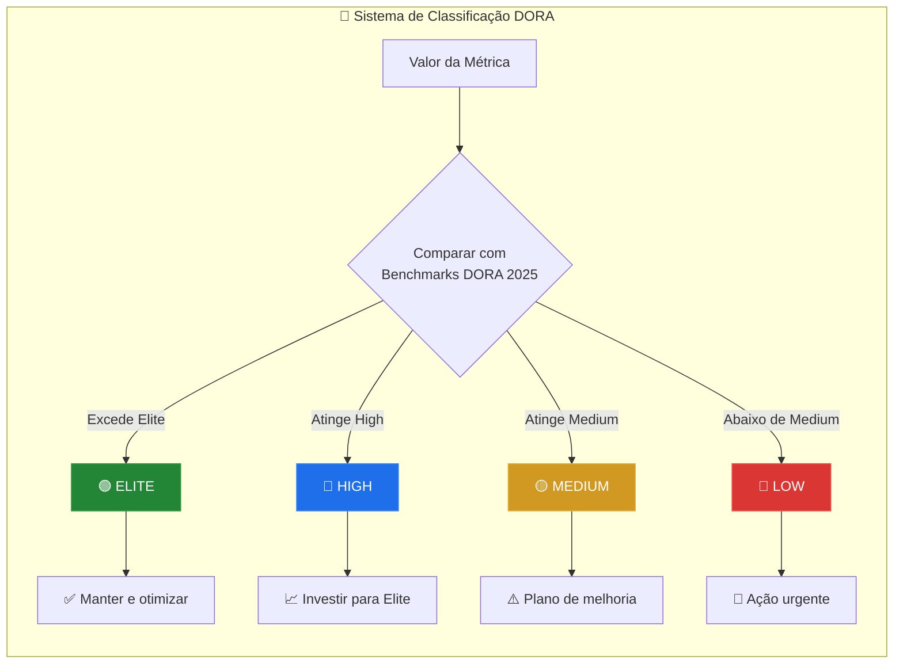
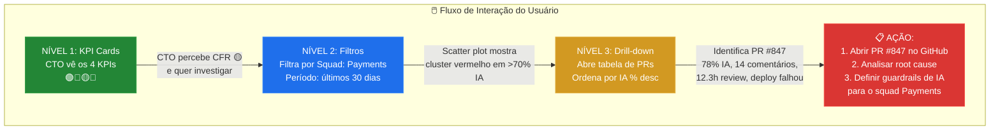

# 3. Design do Dashboard Executivo — Visão CTO

## 3.1 Filosofia de Design

O dashboard segue a abordagem **Overview → Filter → Detail** (Mantra de Shneiderman), organizado em **3 níveis progressivos** de profundidade:

| Nível | Público | Pergunta que Responde | Tempo de Análise |
|-------|---------|----------------------|-----------------|
| **Nível 1 — Macro** | CTO, VP Engineering | "Estamos melhorando ou piorando?" | 10 segundos |
| **Nível 2 — Filtros** | Engineering Managers | "Qual squad/repo precisa de atenção?" | 1-2 minutos |
| **Nível 3 — Drill-down** | Tech Leads | "Qual PR específico causou o problema?" | 5-10 minutos |

---

## 3.2 Wireframe Visual Completo

```mermaid
block-beta
    columns 4

    %% HEADER
    HEADER["🏢 TechFlow — DORA Metrics Dashboard | CTO View"]:4

    %% NÍVEL 1 - KPIs MACRO
    space:4
    N1_TITLE["━━━━━ NÍVEL 1: VISÃO MACRO (KPIs DORA) ━━━━━"]:4

    KPI1["📈 Deployment Freq.\n━━━━━━━━━━\n12.4 /dia\n🟢 ELITE\n▲ +23% vs mês anterior"]:1
    KPI2["⏱️ Lead Time\n━━━━━━━━━━\n4.2 horas\n🔵 HIGH\n▼ -15% vs mês anterior"]:1
    KPI3["🚨 Change Failure Rate\n━━━━━━━━━━\n8.7%\n🟡 MEDIUM\n▲ +3.1% vs mês anterior"]:1
    KPI4["🔄 MTTR\n━━━━━━━━━━\n47 min\n🟢 ELITE\n▼ -22% vs mês anterior"]:1

    %% GRÁFICO DE TENDÊNCIA
    TREND["📊 Tendência DORA — Últimos 6 Meses\n━━━━━━━━━━━━━━━━━━━━━━━━━━━━━━━━━━━\n(Line Chart: 4 métricas DORA ao longo do tempo)\n(Linha pontilhada vertical: 'Adoção IA Generativa')\nJan ─── Fev ─── Mar ─── Abr ─── Mai ─── Jun"]:3
    AI_GAUGE["🤖 Código IA\n━━━━━━━━━━\n42%\ndo código total\n\n📊 Gauge Chart\n0% ───●─── 100%"]:1

    %% NÍVEL 2 - FILTROS
    space:4
    N2_TITLE["━━━━━ NÍVEL 2: FILTROS INTERATIVOS ━━━━━"]:4

    FILTER1["🏷️ Squad\n━━━━━━━━\n☑ Payments\n☑ Platform\n☑ Growth\n☐ Mobile\n☐ Data"]:1
    FILTER2["📦 Repositório\n━━━━━━━━━━━\n☑ payment-svc\n☑ api-gateway\n☐ user-svc\n☐ data-pipeline\n☐ mobile-app"]:1
    FILTER3["📅 Período\n━━━━━━━━\n📅 De: 2025-01-01\n📅 Até: 2025-06-30\n\nPresets:\n• Última semana\n• Último mês\n• Último trimestre"]:1
    FILTER4["🧪 Feature Flag\n━━━━━━━━━━━\n☑ Com IA\n☑ Sem IA\n━━━━━━━━━━━\nComparativo:\n🔘 Antes vs Depois IA\n🔘 Por ferramenta IA"]:1

    BAR_CHART["📊 Deployment Frequency por Squad\n━━━━━━━━━━━━━━━━━━━━━━━━━━━━━━━━━━━━━━━━\n(Stacked Bar Chart: deploys success vs failure por squad)\n\nPayments  ████████████████████░░░ 89%\nPlatform  ███████████████░░░░░░░ 72%\nGrowth    ██████████████████░░░░ 85%\nMobile    ████████░░░░░░░░░░░░░ 61%\nData      ██████████████████████ 95%"]:2
    SCATTER["📊 Lead Time vs % Código IA\n━━━━━━━━━━━━━━━━━━━━━━━\n(Scatter Plot)\n\nEixo X: % Código gerado por IA\nEixo Y: Lead Time (horas)\nCor: Change Failure Rate\nTamanho: num_deploys\n\n● Alta correlação negativa\n  (mais IA → menor lead time)\n⚠ Mas pontos vermelhos\n  concentrados em >60% IA"]:2

    %% NÍVEL 3 - DRILL-DOWN
    space:4
    N3_TITLE["━━━━━ NÍVEL 3: DRILL-DOWN DETALHADO ━━━━━"]:4

    PR_TABLE["📋 Tabela de Pull Requests (Top 20 — Ordenável)\n━━━━━━━━━━━━━━━━━━━━━━━━━━━━━━━━━━━━━━━━━━━━━━━━━━━━━━━━━━━━━━\n| PR # | Título                  | Autor   | IA % | Review (h) | Comments | Status    |\n|------|-------------------------|---------|------|------------|----------|-----------|\n| #847 | feat: new payment flow  | @jsilva | 78%  | 12.3       | 14       | 🔴 Falhou |\n| #846 | fix: auth token refresh | @acoста | 12%  | 1.2        | 3        | 🟢 OK     |\n| #845 | refactor: user service  | @mchen  | 95%  | 18.7       | 21       | 🟡 Revert |\n| #844 | chore: deps update      | @bot    | 0%   | 0.3        | 0        | 🟢 OK     |\n| ...  | ...                     | ...     | ...  | ...        | ...      | ...       |"]:4

    HEATMAP["🗓️ Heatmap: Falhas por Dia/Hora\n━━━━━━━━━━━━━━━━━━━━━━━━━━━━━━━\n        Seg  Ter  Qua  Qui  Sex\n06-09h   ·    ·    ·    ·    ·\n09-12h   ·    ·    ●    ·    ·\n12-15h   ·    ●    ●    ·    ·\n15-18h   ●    ●    ●●   ●    ·\n18-21h   ●●   ●●   ●●●  ●●   ●\n21-00h   ●●●  ●●   ●●   ●    ·\n\n● = incidentes (mais escuro = mais)\n⚠ Pico: Qua-Qui 15h-21h"]:2
    FAILURE_CHART["📊 Taxa de Falha Pós-Deploy por Repo\n━━━━━━━━━━━━━━━━━━━━━━━━━━━━━━━━━━━\n(Horizontal Bar Chart)\n\nuser-service     ██████████████ 14.1% 🔴\npayment-svc      ████████░░░░░░  8.7% 🟡\napi-gateway      ██████░░░░░░░░  6.2% 🟡\ndata-pipeline    ███░░░░░░░░░░░  3.1% 🟢\ninfra-config     ██░░░░░░░░░░░░  1.8% 🟢\n\nLinha de referência: 5% (Elite DORA)"]:2
```



---

## 3.3 Nível 1 — Visão Macro (KPIs DORA Consolidados)

### Componentes Visuais

| Componente | Tipo Visual | Métrica | Detalhes |
|-----------|------------|---------|---------|
| **KPI Card 1** | Número grande + ícone + seta de tendência | Deployment Frequency | Deploys/dia, com classificação DORA (🟢🔵🟡🔴) e variação % vs período anterior |
| **KPI Card 2** | Número grande + ícone + seta de tendência | Lead Time for Changes | Horas médias, com classificação DORA e variação % |
| **KPI Card 3** | Número grande + ícone + seta de tendência | Change Failure Rate | Percentual, com classificação DORA e variação % |
| **KPI Card 4** | Número grande + ícone + seta de tendência | MTTR | Minutos médios, com classificação DORA e variação % |
| **Gráfico de Tendência** | Line Chart (4 linhas) | Todas as 4 métricas | Eixo X: tempo (6 meses). Linha pontilhada vertical marcando "Adoção de IA". Permite ver antes vs. depois |
| **Gauge de IA** | Gauge/Donut Chart | % Código por IA | Percentual consolidado de código gerado por IA no período selecionado |

### Lógica de Semáforo DORA



### Regras de Classificação por Métrica

| Métrica | 🟢 Elite | 🔵 High | 🟡 Medium | 🔴 Low |
|---------|----------|---------|-----------|--------|
| Deployment Frequency | > 1/dia | 1/dia a 1/semana | 1/semana a 1/mês | < 1/mês |
| Lead Time | < 1 hora | 1 hora a 1 dia | 1 dia a 1 semana | > 1 mês |
| Change Failure Rate | < 5% | 5% - 10% | 10% - 15% | > 15% |
| MTTR | < 1 hora | < 1 dia | 1 dia a 1 semana | > 1 mês |

---

## 3.4 Nível 2 — Filtros Interativos

### Filtros Disponíveis

| Filtro | Tipo de Controle | Fonte de Dados | Comportamento |
|--------|-----------------|---------------|---------------|
| **Squad** | Multi-select checkboxes | `dim_repository.squad` | Filtra todos os visuais. Default: todos selecionados |
| **Repositório** | Multi-select dropdown com busca | `dim_repository.repo_name` | Filtrado pelo squad selecionado (cascata) |
| **Período** | Date range picker + presets | `dim_time.date_full` | Presets: 7d, 30d, 90d, 6m, 1y, Custom |
| **Feature Flag IA** | Toggle / Radio buttons | `dim_repository.ai_adoption_level` | "Com IA" / "Sem IA" / "Comparar Antes vs. Depois" |

### Visualizações do Nível 2

| Visual | Tipo | Query Base | Insight Esperado |
|--------|------|-----------|-----------------|
| **Deploys por Squad** | Stacked Bar Chart | `GROUP BY squad, deploy_status` | Qual squad tem mais deploys? Qual tem mais falhas? |
| **Lead Time vs. % IA** | Scatter Plot | `SELECT lead_time, ai_generated_pct, change_fail_rate` | Há correlação entre mais IA e menor lead time? A que custo? |
| **Comparativo Antes/Depois** | Dual Bar Chart | `WHERE date < adoption_date` vs `>= adoption_date` | As métricas melhoraram ou pioraram após adoção de IA? |
| **Review Time por Senioridade** | Box Plot | `GROUP BY seniority_level, uses_ai_tools` | Juniores com IA demoram mais no review que seniores? |

---

## 3.5 Nível 3 — Drill-down Detalhado

### 3.5.1 Tabela de Pull Requests

Tabela interativa com **sorting, filtering e paginação**. Clicável para abrir o PR no GitHub.

| Coluna | Fonte | Descrição | Ordenável | Filtrável |
|--------|-------|-----------|-----------|-----------|
| `PR #` | `fato_deploys` | Número do Pull Request (link para GitHub) | ✅ | ✅ |
| `Título` | GitHub API | Título do PR | ❌ | ✅ (busca) |
| `Autor` | `dim_engineer.github_username` | Quem criou o PR | ✅ | ✅ |
| `IA %` | `fato_deploys.ai_generated_pct` | % de código gerado por IA | ✅ | ✅ (range) |
| `Review Time` | `fato_deploys.pr_review_time_minutes` | Tempo de review em horas | ✅ | ✅ (range) |
| `Comentários` | `fato_deploys.num_comments_review` | Total de comentários no review | ✅ | ✅ |
| `Revisões` | `fato_deploys.num_revisions_requested` | Vezes que pediu alteração | ✅ | ✅ |
| `Deploy Status` | `fato_deploys.deploy_status` | 🟢 OK / 🟡 Revert / 🔴 Falhou | ✅ | ✅ |

### 3.5.2 Scatter Plot: Tempo de Revisão vs. % Código IA

```
Eixo X: ai_generated_pct (0% a 100%)
Eixo Y: pr_review_time_minutes (convertido em horas)
Cor: deploy_status (🟢 verde = success, 🔴 vermelho = failure)
Tamanho do ponto: lines_added + lines_removed (volume de mudança)
Tooltip: PR title, autor, squad, num_comments
```

**Insight esperado**: Quando `ai_generated_pct > 60%`, o `pr_review_time` tende a ser 2-3x maior e os pontos vermelhos (falhas) se concentram nessa região.

### 3.5.3 Heatmap: Falhas por Dia/Hora

**Configuração**:
- Eixo X: Dia da semana (Segunda a Sexta)
- Eixo Y: Faixa horária (06h-09h, 09h-12h, ..., 21h-00h)
- Cor: Intensidade proporcional ao número de deploys com falha

**Insight esperado**: Deploys feitos após as 18h (pressão para entregar antes do fim do dia) têm taxa de falha significativamente maior. Deploys na sexta-feira à tarde são os mais arriscados.

### 3.5.4 Taxa de Falhas Pós-Deploy por Repositório

**Configuração**:
- Horizontal bar chart ordenado por `change_failure_rate` decrescente
- Linha de referência vertical em 5% (benchmark Elite DORA)
- Cor: gradiente de verde (< 5%) a vermelho (> 15%)
- Label: nome do repositório + percentual + classificação DORA

**Insight esperado**: Repositórios com `ai_adoption_level = 'high'` tendem a aparecer no topo (maior taxa de falha), validando ou refutando a hipótese do CTO.

---

## 3.6 Interações e Navegação



---

## 3.7 Especificações Técnicas do Dashboard

| Aspecto | Especificação |
|---------|--------------|
| **Ferramenta** | Power BI (Desktop + Service) ou Looker Studio |
| **Fonte de dados** | Conexão direta ao BigQuery (Direct Query ou Import com refresh horário) |
| **Atualização** | Refresh automático a cada 1 hora (sincronizado com pipeline ELT) |
| **Acesso** | CTO: viewer. Eng Managers: viewer com filtros por squad. Tech Leads: full drill-down |
| **Mobile** | Layout responsivo para visualização em tablet (reuniões executivas) |
| **Export** | PDF mensal automatizado para board report |
| **Alertas** | Configurar alertas quando CFR > 10% ou MTTR > 2h (push notification) |

---

> **Próximo passo**: A [Análise Estratégica](../04_analise_estrategica/analise_estrategica.md) interpreta os dados do dashboard para gerar insights acionáveis sobre o impacto da IA.
