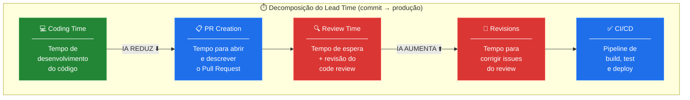
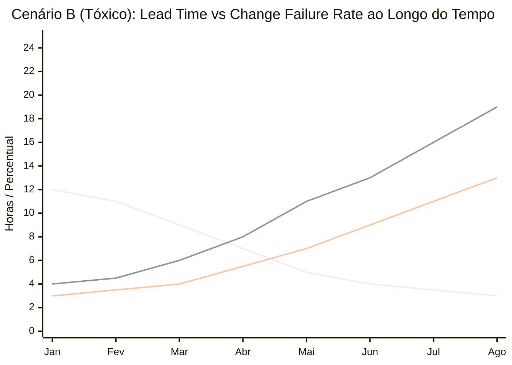
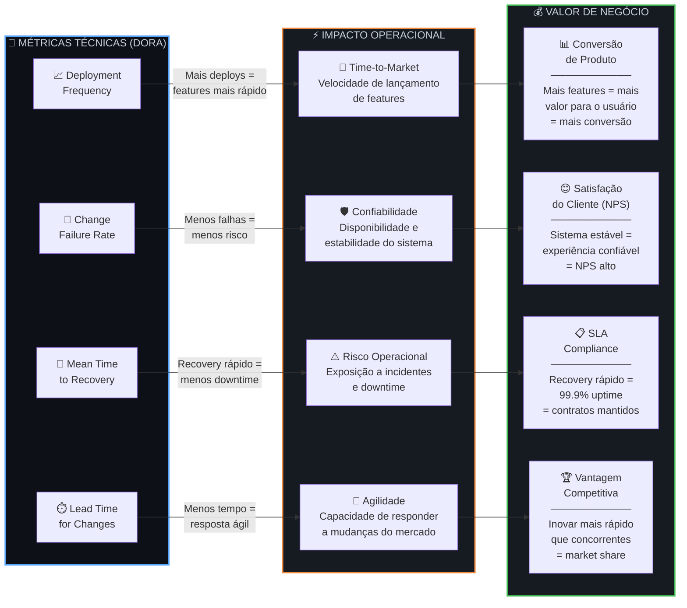
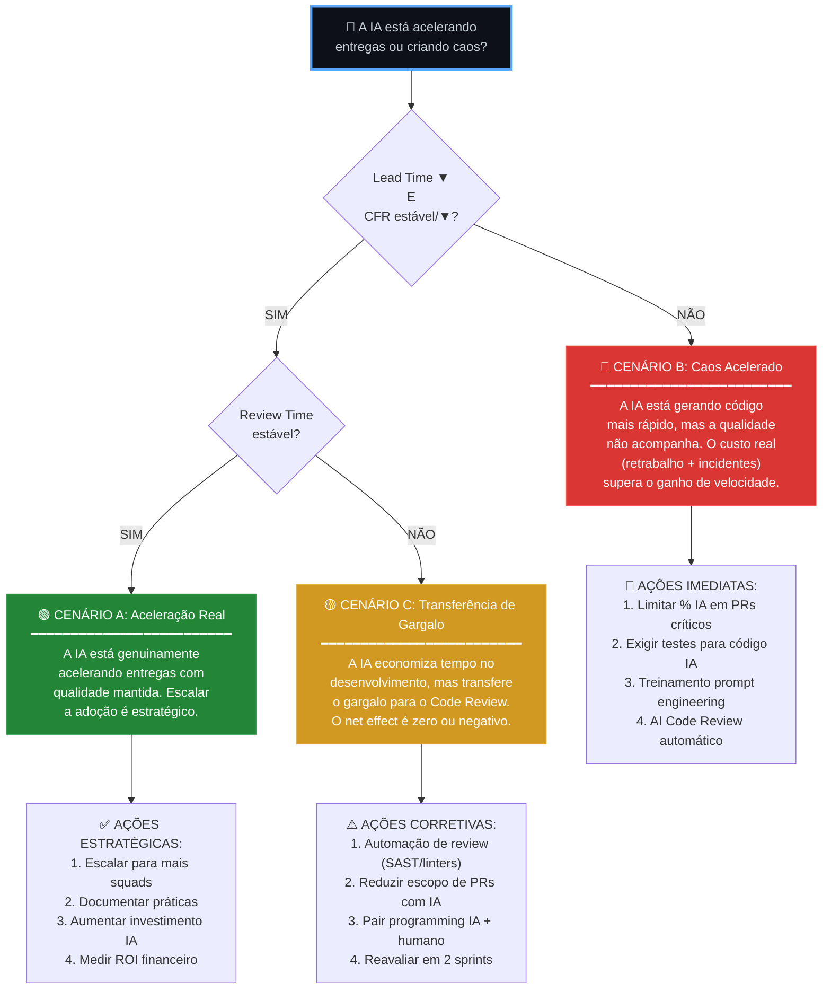

# 4. Análise Estratégica — IA Generativa vs. Entregas Reais

## 4.1 Diagnóstico: O Lead Time Revela a Verdade

### A Pergunta Central do CTO

> *"A IA está acelerando a entrega real ou apenas aumentando o volume de código mais rápido?"*

Para responder, precisamos **decompor o Lead Time** em suas partes constituintes e analisar o impacto da IA em cada fase:



### A Revelação dos Dados

O dashboard permite identificar **3 cenários possíveis** ao cruzar Lead Time com Change Failure Rate e % de código IA:

---

### 📊 Cenário A: IA Saudável — "Aceleração Real"

```
Lead Time:        ▼ Diminuindo
Change Fail Rate: → Estável ou ▼ Diminuindo  
Deployment Freq:  ▲ Aumentando
MTTR:             → Estável
% Código IA:      ▲ Crescendo
```

**O que os dados mostram**:
- A IA reduz o `coding_time` (fase de desenvolvimento) sem comprometer a qualidade
- O `review_time` se mantém estável porque o código IA é de boa qualidade
- Os deploys aumentam **e** a taxa de falha se mantém controlada
- **Diagnóstico**: IA está funcionando. O time internalizou boas práticas de prompt engineering e os guardrails estão efetivos

**Ação recomendada**: Escalar a adoção para mais squads. Documentar as práticas que estão funcionando.

---

### 📊 Cenário B: IA Tóxica — "Caos Mais Rápido"

```
Lead Time:        ▼ Diminuindo (ENGANOSO!)
Change Fail Rate: ▲ AUMENTANDO ⚠️
Deployment Freq:  ▲ Aumentando
MTTR:             ▲ AUMENTANDO ⚠️
% Código IA:      ▲ Crescendo
```

**O que os dados mostram**:
- A IA reduz drasticamente o `coding_time`, gerando um falso senso de velocidade
- Porém, o `review_time` explode porque revisores precisam analisar código que não entendem completamente
- Deploys aumentam, mas falhas também — **a velocidade é ilusória**
- O MTTR aumenta porque debugar código gerado por IA é mais difícil (código funcional, mas frágil)
- **Diagnóstico**: A IA está criando **dívida técnica acelerada**. O Lead Time é menor, mas o custo real (retrabalho + incidentes) é maior

**Ação recomendada**: Implementar guardrails imediatos (limitar % de IA por PR, exigir testes automatizados para código IA, treinamento de prompt engineering).

---

### 📊 Cenário C: IA Neutra — "Volume Sem Valor"

```
Lead Time:        → Estável
Change Fail Rate: → Estável
Deployment Freq:  ▲ Aumentando (levemente)
MTTR:             → Estável
% Código IA:      ▲ Crescendo
Review Time:      ▲ AUMENTANDO ⚠️
```

**O que os dados mostram**:
- A IA gera mais linhas de código, mas o tempo economizado no desenvolvimento é **consumido integralmente no review**
- O net effect é zero — a IA apenas **transferiu o gargalo** do desenvolvimento para o review
- **Diagnóstico**: A IA não está agregando valor real. O pipeline inteiro não ficou mais rápido; o gargalo apenas mudou de lugar

**Ação recomendada**: Investir em automação de review (linters inteligentes, SAST/DAST para código IA), reduzir o % de IA em PRs críticos.

---

## 4.2 Visualização dos Cenários



**Leitura do gráfico**:
- A partir de **Março** (adoção de IA) o lead time cai consistentemente ✅
- Porém, a **Change Failure Rate cruza o threshold** de 10% em Maio e continua subindo ❌
- O **Review Time** cresce linearmente, mostrando que o gargalo se transferiu ⚠️
- O **cruzamento das curvas** (Lead Time ↓ enquanto CFR ↑) é o indicador definitivo do "caos mais rápido"

---

## 4.3 Framework de Correlação: Métricas Técnicas → Valor de Negócio

### O Modelo de Conexão



### Detalhamento das Conexões

#### 📈 Deployment Frequency → Time-to-Market → Conversão de Produto

| Métr. Técnica | Impacto Operacional | Impacto no Negócio | Exemplo Concreto |
|--------------|--------------------|--------------------|-----------------|
| **12.4 deploys/dia** (Elite) | Features chegam ao usuário em horas, não semanas | Menor time-to-market = testar hipóteses de produto mais rápido | A TechFlow lança o novo checkout em 3 dias em vez de 3 semanas. A/B test mostra +18% de conversão. Receita mensal sobe R$ 240K |
| **0.5 deploys/semana** (Low) | Features ficam semanas em staging | Perda de oportunidade de mercado | Concorrente lança feature similar primeiro. TechFlow perde early adopters |

**Fórmula de impacto estimado**:
```
ROI_deploy_freq = (features_delivered_per_month × avg_conversion_lift × avg_revenue_per_user) 
                  - (cost_of_ci_cd_infra + cost_of_engineering_time)
```

---

#### 🚨 Change Failure Rate → Confiabilidade → Satisfação do Cliente (NPS)

| Métr. Técnica | Impacto Operacional | Impacto no Negócio | Exemplo Concreto |
|--------------|--------------------|--------------------|-----------------|
| **CFR < 5%** (Elite) | Sistema confiável, incidentes raros | Usuários confiam na plataforma, NPS > 50 | 98% dos pagamentos processados sem erro. Churn cai 12%. Customer Success reporta aumento de upsell |
| **CFR > 15%** (Low) | Incidentes frequentes, degradação perceptível | Usuários perdem confiança, churn aumenta, reviews negativos | 1 em cada 7 deploys causa bug visível. App Store rating cai de 4.5 para 3.8. Churn sobe 25% |

**Fórmula de impacto estimado**:
```
Cost_per_failure = (avg_downtime_minutes × revenue_per_minute) 
                 + (engineering_hours_to_fix × hourly_rate)
                 + (customer_churn_risk × lifetime_value)
```

---

#### 🔄 MTTR → Disponibilidade → SLA Compliance → Retenção

| Métr. Técnica | Impacto Operacional | Impacto no Negócio | Exemplo Concreto |
|--------------|--------------------|--------------------|-----------------|
| **MTTR < 1h** (Elite) | 99.95% availability | SLAs cumpridos, contratos B2B mantidos | Cliente enterprise com SLA de 99.9% vê 2 incidentes/mês resolvidos em 30 min. Contrato renovado por +2 anos (R$ 1.2M ARR) |
| **MTTR > 1 dia** (Low) | 99% availability (87.6h downtime/ano) | SLAs violados, penalidades contratuais, perda de clientes | 3 incidentes com MTTR de 8h no Q1. SLA violado. Multa contratual de R$ 150K. Cliente avalia migração para concorrente |

**Fórmula de disponibilidade**:
```
Availability = 1 - (total_downtime_minutes / total_minutes_in_period)
99.9% uptime = máximo 43.8 min de downtime/mês
99.95% uptime = máximo 21.9 min de downtime/mês
```

---

#### ⏱️ Lead Time → Velocidade de Inovação → Vantagem Competitiva

| Métr. Técnica | Impacto Operacional | Impacto no Negócio | Exemplo Concreto |
|--------------|--------------------|--------------------|-----------------|
| **LT < 1h** (Elite) | Feedback loop instantâneo: código → produção em minutos | Capacidade de responder a tendências de mercado em tempo real | Concorrente anuncia nova feature às 10h. TechFlow responde com feature equivalente no mesmo dia. Matéria no TechCrunch: "TechFlow moves fast" |
| **LT > 1 mês** (Low) | Release cycles longos, burocracia pesada | Incapacidade de responder ao mercado. Roadmap desatualizado antes de ser executado | Feature planejada em Q1 chega em Q3. Mercado já mudou. Investimento de 6 meses de eng sem ROI |

---

## 4.4 Diagnóstico Final para o CTO

### A Resposta — Baseada em Dados



---

### Resumo Executivo para o CTO

> **O Lead Time isolado é uma métrica enganosa quando se usa IA Generativa.**
> 
> É possível ter um Lead Time "Elite" (< 1 hora) e ainda assim estar em crise, se o Change Failure Rate e o Review Time estiverem crescendo. O verdadeiro indicador de saúde não é a velocidade individual de nenhuma métrica, mas o **equilíbrio entre velocidade e estabilidade**.
> 
> A IA Generativa é uma ferramenta de **amplificação**: ela amplifica tanto a produtividade quanto os problemas. Se o time tem boas práticas de engenharia (testes, reviews, arquitetura limpa), a IA amplifica a produtividade. Se o time tem práticas fracas, a IA amplifica o caos.
> 
> **A recomendação é monitorar o "DORA Balance Score"** — a relação entre métricas de velocidade (DF, LT) e métricas de estabilidade (CFR, MTTR). Se a velocidade sobe enquanto a estabilidade cai, a IA está criando uma bolha de dívida técnica que eventualmente estourará.

---

### Proposta: DORA Balance Score

```sql
-- DORA Balance Score: razão entre velocidade e estabilidade
-- Score > 1.0 = velocidade crescendo mais que instabilidade (saudável)
-- Score < 1.0 = instabilidade crescendo mais que velocidade (problema)
-- Score ≈ 1.0 = crescimento proporcional (neutro)

WITH velocity AS (
    SELECT 
        dt.month_number,
        dt.year,
        COUNT(f.deploy_id) / 30.0 AS daily_deploy_freq,
        1.0 / NULLIF(AVG(f.lead_time_minutes) / 60.0, 0) AS lead_time_inverse  -- maior = mais rápido
    FROM fato_deploys f
    JOIN dim_time dt ON f.time_id = dt.time_id
    WHERE f.environment = 'production'
    GROUP BY dt.month_number, dt.year
),
stability AS (
    SELECT 
        dt.month_number,
        dt.year,
        1.0 - (SUM(CASE WHEN f.is_rollback THEN 1 ELSE 0 END) * 1.0 / COUNT(*)) AS cfr_health,  -- 1 = perfeito, 0 = tudo falha
        1.0 / NULLIF(AVG(CASE WHEN f.is_rollback THEN f.recovery_time_minutes END) / 60.0, 0) AS mttr_inverse  -- maior = mais rápido recovery
    FROM fato_deploys f
    JOIN dim_time dt ON f.time_id = dt.time_id
    WHERE f.environment = 'production'
    GROUP BY dt.month_number, dt.year
)
SELECT 
    v.year,
    v.month_number,
    ROUND(v.daily_deploy_freq, 2) AS deploy_freq,
    ROUND(v.lead_time_inverse, 2) AS speed_score,
    ROUND(s.cfr_health, 2) AS stability_score,
    ROUND(
        (v.daily_deploy_freq * v.lead_time_inverse) / 
        NULLIF((1.0 - s.cfr_health) * (1.0 / NULLIF(s.mttr_inverse, 0)), 0),
        2
    ) AS dora_balance_score
FROM velocity v
JOIN stability s ON v.month_number = s.month_number AND v.year = s.year
ORDER BY v.year, v.month_number;
```

**Interpretação do DORA Balance Score**:

| Score | Status | Significado | Ação |
|-------|--------|------------|------|
| **> 2.0** | 🟢 Excelente | Velocidade crescendo muito mais rápido que instabilidade | Manter estratégia |
| **1.0 - 2.0** | 🔵 Saudável | Velocidade e estabilidade em equilíbrio | Monitorar tendência |
| **0.5 - 1.0** | 🟡 Atenção | Instabilidade começando a crescer | Investigar causa raiz |
| **< 0.5** | 🔴 Crítico | Instabilidade crescendo mais rápido que velocidade | Ação imediata: freiar IA, investir em qualidade |

---

## 4.5 Conclusão — A Pergunta Final Respondida

| Pergunta | Resposta Baseada em Dados |
|----------|--------------------------|
| "A IA está acelerando as entregas?" | **Depende de qual parte do Lead Time você olha.** A IA inequivocamente reduz o `coding_time`. Mas se o `review_time` e o `recovery_time` absorverem esse ganho, o throughput real é o mesmo ou pior. |
| "Ou apenas criando caos mais rápido?" | **Olhe o CFR.** Se está subindo junto com o Deployment Frequency, você está criando caos mais rápido. Se está estável ou caindo, a IA está genuinamente ajudando. |
| "Devemos continuar investindo?" | **Use o DORA Balance Score.** Score > 1.0: sim, escale. Score < 0.5: pause e invista em guardrails antes de continuar. |

---

> *"A velocidade sem controle é apenas pressa. A verdadeira engenharia é entregar rápido E com segurança."*
